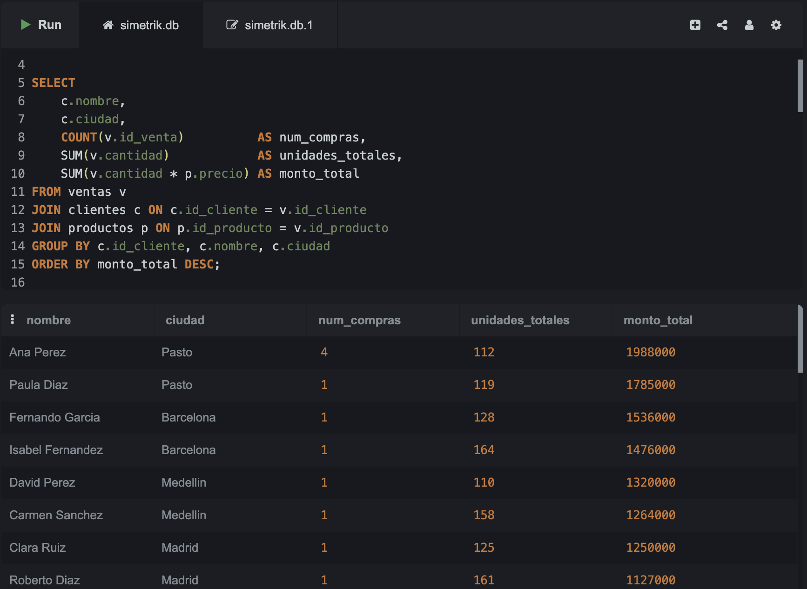
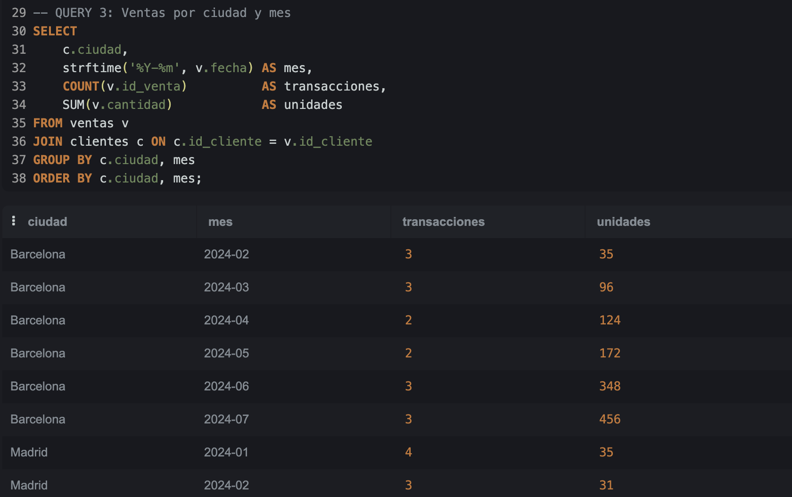
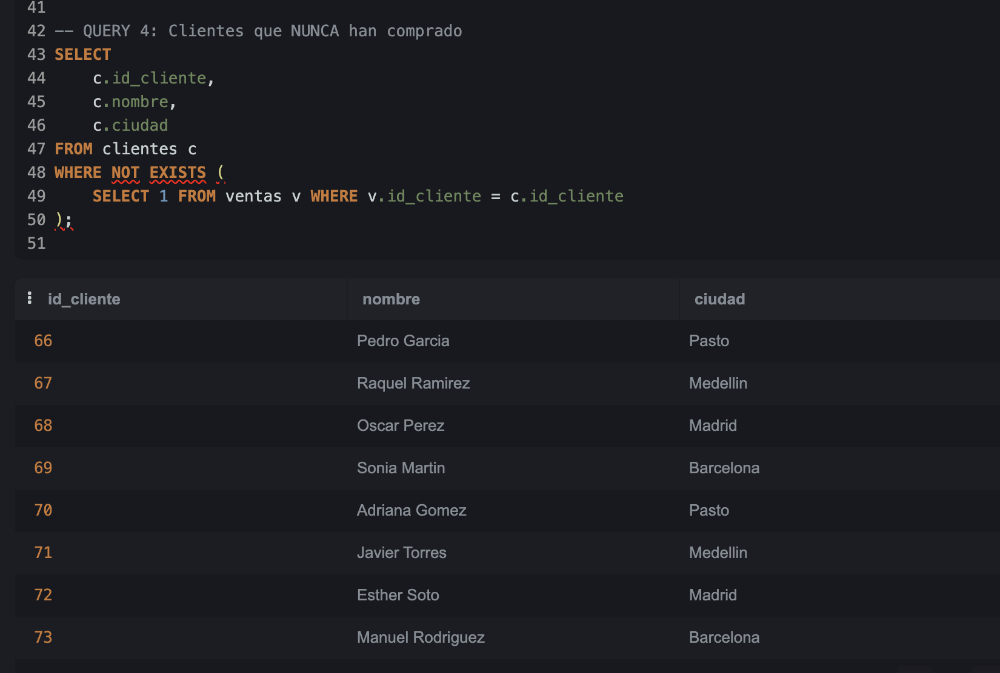
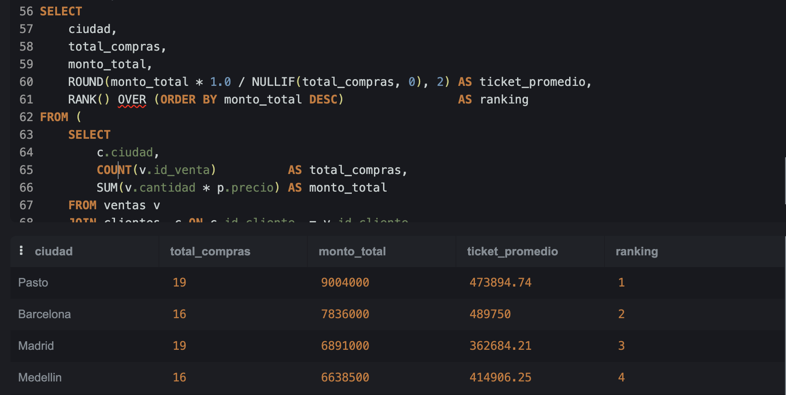

# Prueba Técnica — Simetrik

---

> ### Una reflexión honesta sobre cómo se construyó esta solución
>
> Esta prueba técnica fue desarrollada con el apoyo activo de herramientas de inteligencia artificial —
> específicamente Claude Code como agente de desarrollo. No lo menciono como advertencia, sino como una
> declaración de principios sobre lo que creo yo Juan David Rincón que significa ser un buen ingeniero/Cientifico hoy.
>
> El paradigma está cambiando. Durante décadas, la pregunta en una prueba técnica fue *"¿puedes escribir
> este código?"*. Hoy, esa pregunta ha perdido relevancia. Más del 90% de los desarrolladores ya usa herramientas
> de IA mensualmente, y equipos enteros en empresas como Atlassian operan con ingenieros que escriben cero
> líneas de código manualmente — todo es orquestación de agentes que producen entre 2x y 5x más que antes.
>
> La nueva pregunta es más exigente: **¿puedes diseñar la solución correcta, orquestar los agentes que la
> construyen, y tener el ojo crítico para detectar qué está mal en lo que generaron?**
>
> En esta prueba descubrí y corregí errores que la IA introdujo: endpoints de Spotify deprecados que
> requerían investigar la alternativa vigente, queries SQL con sintaxis de PostgreSQL ejecutadas en SQLite,
> una paginación que cortaba resultados sin verificar `total_available`, y una métrica de "ticket promedio"
> que calculaba unidades en lugar de dinero. Detectarlos requiere
> entender el problema de negocio, conocer las APIs, y razonar sobre los datos.
>
> Como plantea Addy Osmani — *"vibe coding"* (generar código sin entenderlo) no es lo mismo que ingeniería
> asistida por IA. La creación rápida se está convirtiendo en una commodity; lo que se vuelve escaso y
> valioso es el **juicio de ingeniería**: saber qué construir, por qué, y cómo verificar que funciona.
>
> Eso es lo que intenté demostrar aquí, y en caso de continuar seguire usando IA de forma critica.

---

Solución a los tres puntos de la prueba técnica de integraciones.

---

## Requisitos previos

- Python 3.11+
- [uv](https://docs.astral.sh/uv/) (gestor de paquetes)

## Instalación

```bash
git clone https://github.com/jdrincone/simetrik.git
cd simetrik

# Instalar dependencias
uv pip install -e .

# Configurar credenciales de Spotify
cp .env.example .env
# Editar .env con SPOTIFY_CLIENT_ID y SPOTIFY_CLIENT_SECRET
```

---

## Punto 1 — Extracción de canciones por género desde Spotify API

### Cómo ejecutarlo

```bash
uv run python main.py p1                        # Colombia por defecto
uv run python main.py p1 --country MX           # México
uv run python main.py p1 --country US --output mi_carpeta/
```

Genera un CSV por género en `output/punto_1/` (ej: `pop.csv`, `reggaeton.csv`).

### Por qué esta solución

La API de Spotify deprecó en noviembre 2024 los endpoints de browsing y recomendaciones que habrían sido la solución natural:

| Endpoint | Estado |
|---|---|
| `/browse/categories/{id}/playlists` | 403 — deprecado |
| `/recommendations/available-genre-seeds` | 404 — deprecado |

La alternativa vigente es usar `/search` con el filtro `genre:`, que permite buscar tracks por género directamente. El único límite no documentado es que este filtro acepta máximo `limit=10` por request, por lo que se pagina con `offset` para recolectar hasta 50 tracks por género. Para géneros con pocos resultados en el mercado, se verifica `total_available` en la respuesta para no paginar más allá de lo disponible.

### Cómo funciona internamente

```
SpotifyAuth          SpotifyClient         extractor
─────────────        ─────────────         ─────────────────────
POST /api/token  →   GET /search           por cada género:
token en caché       retry 3 veces           página offset 0,10,20,30,40
refresh en 401       espera en 429           construye DataFrame
invalidate()         session pooling         deduplica por (track, artista)
                                             ordena por popularidad
                                             guarda CSV
```

**Decisiones de diseño:**
- `requests.Session()` reutiliza conexiones TCP para las 100 requests (~20 géneros × 5 páginas)
- Token con buffer de 30s antes de expirar evita peticiones fallidas por token casi-expirado
- `invalidate()` en `SpotifyAuth` respeta encapsulamiento — `SpotifyClient` no accede a atributos privados directamente

---

## Punto 2 — Parser de archivo de ancho fijo

### Cómo ejecutarlo

```bash
uv run python main.py p2
uv run python main.py p2 --output mi_carpeta/
```

Genera `output/punto_2/transacciones.csv` con 15 006 filas y 202 columnas.

### Por qué esta solución

El archivo `transacciones_1.txt` es un archivo COBOL-style de ancho fijo: cada línea tiene exactamente 680 caracteres y los campos se extraen por posición absoluta, no por delimitadores. El Excel de documentación define las posiciones de inicio y fin de cada campo en la hoja **Body**.

Esta estructura es común en sistemas bancarios y de mainframe donde la compatibilidad con sistemas legacy exige formatos fijos.

### Cómo funciona internamente

```
Documentación prueba.xlsx          transacciones_1.txt
        ↓                                   ↓
    schema.py                           parser.py
─────────────────                   ─────────────────
Lee hoja "Body"                     skiprows=1  (Header del batch)
filtra GROUP_FORMATS                skipfooter=1 (Tail con totales)
retorna 202 campos hoja             dtype=str   (preserva ceros iniciales)
con pos_ini y pos_fin               encoding=latin-1
                                    engine=python (requerido por skipfooter)
        ↓                                   ↓
   colspecs = [(pos_ini - 1, pos_fin), ...]   ← conversión 1-indexed → 0-indexed
                        ↓
              pd.read_fwf(colspecs=...)
                        ↓
              transacciones.csv  (15 006 × 202)
```

**Decisiones de diseño:**
- La hoja Body tiene 253 filas pero 51 son contenedores (`Grupo`, `GROUP`, `GRP`) — se filtran para obtener solo los 202 campos de datos reales
- `dtype=str` evita que pandas convierta `"0001"` → `1` o fechas a `datetime` automáticamente
- El nombre del Excel contiene ñ que se corrompe según el OS; se usa `glob("Documentaci*.xlsx")` en lugar de un nombre hardcodeado

---

## Punto 3 — Análisis SQL

### Cómo ver las queries

```bash
uv run python main.py p3
```

### Configuración

Ejecutar en [sqliteonline.com](https://sqliteonline.com) seleccionando el engine **SQLite** (requiere SQLite 3.25+ para la Query 5 con window functions — sqliteonline.com lo cumple):

1. Pegar y ejecutar el contenido de `docs/sentencias_punto_2.txt` (crea tablas e inserta datos)
2. Pegar y ejecutar las queries de `src/punto_3_sql/queries.sql`

### Preguntas que se pueden responder con la data

**Q1 — ¿Quiénes son los clientes que más gastan y cuánto llevan comprado?**


---

**Q2 — ¿Cuáles son los 5 productos más demandados por volumen de unidades?**



---

**Q3 — ¿Cómo evoluciona la actividad de compra por ciudad a lo largo del año?**



---

**Q4 — ¿Qué clientes registrados nunca han realizado ninguna compra?**



---

**Q5 — ¿Qué ciudad genera más ingresos y cuál es su ticket promedio por transacción?**



---

Preguntas adicionales posibles:
- ¿Hay productos que solo se vendieron una vez? _(variante de Q2 con `HAVING COUNT = 1`)_
- ¿Qué par cliente-producto tuvo el mayor gasto acumulado?

### Patrones SQL utilizados

- **JOIN triple con agregación** — relacionar tres tablas y calcular métricas agregadas
- **LIMIT sobre ORDER BY** — top-N eficiente sin subquery
- **NOT EXISTS** — anti-join; más eficiente que `LEFT JOIN ... IS NULL` porque hace short-circuit al encontrar la primera coincidencia. Esto es muy útil.
- **Subquery como tabla + RANK() OVER** — window function para ranking sin colapsar filas
- **NULLIF(x, 0)** — convierte 0 en NULL para que la división retorne NULL en lugar de error; útil cuando el divisor podría venir de fuentes externas o ser calculado en un contexto más amplio

---

## Estructura del proyecto

```
simetrik/
├── main.py                        # CLI: comandos p1, p2, p3
├── src/
│   ├── punto_1_spotify/
│   │   ├── auth.py                # OAuth Client Credentials con caché de token
│   │   ├── client.py              # HTTP client con retry y rate limit
│   │   └── extractor.py           # Lógica de extracción y generación de CSVs
│   ├── punto_2_parser/
│   │   ├── schema.py              # Lee posiciones de campos desde Excel
│   │   └── parser.py              # Parsea archivo de ancho fijo con pd.read_fwf
│   └── punto_3_sql/
│       └── queries.sql            # 5 queries analíticas
├── docs/
│   ├── sentencias_punto_2.txt     # DDL + datos para SQLite
│   └── transacciones_1.txt        # Archivo de ancho fijo (15 008 líneas)
└── output/                        # Generado al ejecutar (no versionado)
    ├── punto_1/                   # CSVs por género
    └── punto_2/                   # transacciones.csv
```
